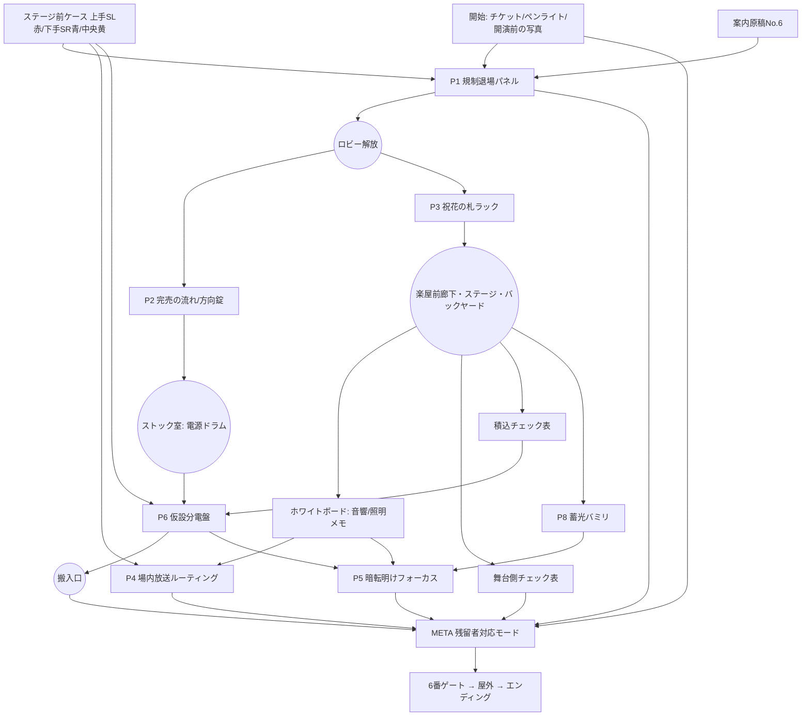

# LAST TO LEAVE ─ 終演後のマリンメッセ福岡A館
開発用設計ドキュメント（ネタバレを含む。公開ビルドには含めない）

---

## 1. リサーチと採用した設計原則

| 参照 | 読み取った設計思想 | 本作での採用 |
|---|---|---|
| Ron Gilbert「Puzzle Dependency Charts」 [grumpygamer](https://grumpygamer.com/puzzle_dependency_charts/) / [Game Developer: Puzzle Dependency Graph Primer](https://www.gamedeveloper.com/design/puzzle-dependency-graph-primer) | ゴールから逆算して依存を描く。一本線は単調、グラフは「茂み状(bushy)」に。ボトルネック（入次数の高いノード）で物語を収束。循環依存はクリア不能を生む。 | §5 の PDG。P1 の後は2系統、中盤は最大4問並列、搬入口で収束。自動テストで非循環・到達可能性を検証。 |
| The Room（Fireproof Games） [UX Magazine](https://uxmag.com/articles/player-centric-design-the-ux-of-the-room) / [Pratt IXD critique](https://ixd.prattsi.org/2019/09/design-critique-the-room-android-app/) | 操作の手触り、装置が「状態を持って」反応すること。飾りに見えた物が機能だと気付く瞬間が快感。プレイヤーが何を考えるかを常に設計する。 | 装置は必ず物理的な状態変化（ランプ・扉・照明・シャッター）で応える。ステージ前ケースのテープ色（飾り）が後で系統コードだと分かる。 |
| Rusty Lake / Cube Escape [PCWorld](https://www.pcworld.com/article/402578/cube-escape-paradox-review.html) / [Shetani's Lair](https://shetanislair.com/en/posts/rusty-lake) | 台詞やカットシーンを使わず、環境とパズルそのもので物語る。拡大→引きの視点で世界の変化を見せる。 | 物語はチェック表・無線メモ・ホワイトボード・放送ログのみ。独白は最小。正解後は引きの画面に戻ると変化が見える。 |
| Escape Simulator [Room Escape Artist review](https://roomescapeartist.com/2021/12/24/pine-studios-escape-simulator-review/) / [Adventure Gamers](https://adventuregamers.com/article/escape-simulator) | 部屋内で複数の謎を同時進行できる非線形性。多様な操作（並べ替え・暗号・配置）。 | 操作を毎問変える（グリッド選択／方向錠／札の配置／ルーティング／蓄光照射／ブレーカー／照明フォーカス／経路指定）。 |
| HER TREES シリーズ [AUTOMATON](https://automaton-media.com/articles/newsjp/20260219-422479/) / [Steam](https://store.steampowered.com/app/2725090/HER_TREES__THE_PUZZLE_HOUSE/) | 計算も言葉も不要、観察と「ひらめき」だけで解ける。メモ不要で情報が画面内に完結。 | 算数・知識問題を排除。必要情報はスマホ写真で再確認でき、紙メモを要求しない。 |
| Room Escape Artist「Escape Room Hint Systems」 [link](https://roomescapeartist.com/2019/10/24/escape-room-hint-systems/) / [Tabletop 11 principles](https://roomescapeartist.com/2018/09/09/11-principles-of-tabletop-escape-game-design/) | 詰まりを長く放置しない。ヒントはプレイヤーが選べる形で段階的に（nudge→clue→reveal）。半数以上がヒントを要する謎は壊れている。世界観に馴染む提示。 | スマホ内ヒント3段階＋「答えを見る」を別操作。「今の情報だけでは解けなさそう」表示で存在しない解法を考え続けさせない。 |

### 必須品質基準（全謎に適用）
1. 必要な情報はすべてゲーム世界内にある（外部知識ゼロ。「上手＝客席から見て右」もゲーム内で見える）。
2. 必要な情報は後から再確認できる（カメラ写真・自動メモ・インベントリ観察）。
3. ピクセルハント禁止（ホットスポットは最小でも画面幅の約5%以上）。
4. 解答後に「あれはこのためだったのか」となる（色テープ、チケット、上手の札）。
5. 総当たりより推論が早い（最小でも数百通り。誤答はペナルティなしだが正誤以外の情報を漏らさない）。

---

## 2. 事実と創作の切り分け

**ゲーム内で使う公開事実（雰囲気のみ・解答には不要）**
- 2024年12月5日、日向坂46「Happy Magical Tour 2024」福岡公演（マリンメッセ福岡）で濱岸ひより卒業セレモニーが行われた。[THE FIRST TIMES](https://www.thefirsttimes.jp/report/0000531378/) / [エケペディア](https://48pedia.org/Happy_Magical_Tour_2024)
- ツアー期間 2024/11/19〜12/26。濱岸ひよりは福岡県出身、2017年加入（ファン向け小ネタにのみ使用）。
- ファンの呼称「おひさま」。

**すべて創作**
- 館内のブロック割（A〜D×1〜3）、扉番号、ゲート番号、バックヤード・搬入口の配置。
- 「規制退場パネル」「館内制御盤（残留者対応モード）」「仮設分電盤」などの装置。いずれも抽象化したゲーム用の架空設備で、実在施設の設備・解錠手順・電気工事手順を再現しない。
- スタッフ、祝花の送り主、物販商品リスト、チェック表、無線メモ。実在の関係者名は一切使わない。
- 楽曲・映像・写真・ロゴ・本人画像は不使用。画像は生成AI（Higgsfield / Z Image）で人物なし・文字なしで生成し、文字情報はSVGで重ねる。音はWebAudioによるプロシージャル合成のみ。

---

## 3. 物語（表と裏）

- **表**：規制退場の最終組だったプレイヤーは、卒業セレモニーの余韻で座席に残っていた。気付くと客電は落ち、ゲートは閉館処理で施錠されていた。
- **真相（環境から読み取る）**：最終確認は「客席側スタッフ（客席から見た図）」と「舞台側スタッフ（舞台から見た図）」で分担した。舞台側の図面は舞台から見た向きなのに、A〜Dを左から手書きで振っていた。結果、両者とも**A3・B3を確認**し、**C3・D3は誰も見ていない**。無線で「C・D OK」と報告され、全区画退場完了→閉館シーケンスが走った。悪人はいない。
- **テーマ**：公演は終わった。セレモニーも終わった。最後にプレイヤーが「ここにまだ一人いる」と自分の居場所を申告することで、館が順に灯りを戻す。終わったあとも、そこにいた時間は消えない。

---

## 4. エリアと導線

```
ARENA(客席・FOH・ステージ前) ──P1──> LOBBY(ゲート・物販・祝花)
  LOBBY/物販 ──P2──> ストック室 ──> BACKYARD
  LOBBY/祝花 ──P3──> 楽屋前廊下 ──> ステージ上 / BACKYARD
  BACKYARD ──P6(電源)──> 搬入口(DOCK) ──META──> 6番ゲート ──> 屋外
```

---

## 5. Puzzle Dependency Graph



- 非循環（`tests/logic.test.ts` で DAG 検証と全順序シミュレーション）。
- 並列帯：P1後 {P2,P3}／P3後 {P2,P4,P8}／P2・P3後 {P4,P6,P8}／P6・P8後 {P4,P5}。
- クロスルーム型：P4（FOH×廊下×ステージ前）、P5（FOH×ステージ×廊下×バックヤード）、P6（バックヤード×ストック室×ステージ前）、P3（現在×開演前の写真）、META（全域）。
- 変換型：P2（時刻→盤面位置→方向）、P5（舞台視点→客席視点の180°回転）、P3（高さ×花器×札形の対応付け）、META（舞台視点の図面への鏡映）。
- 再解釈：ステージ前ケースのテープ色（序盤は背景）→P4/P6で系統コード。チケット（開始時から所持）→METAの答え。
- メタ：P1（通った扉）、P4（放送のゲート番号）、P5/廊下（舞台視点の理解）、チケット（区画）を最終パネルで再利用。

---

## 6. 主要謎（fairness review 形式）

### P1 規制退場パネル（客席扉4）
- **Player sees**：扉横の架空パネル。4×3のブロックボタン（STAGEが上）。「最終組 再案内」。
- **Player knows**：案内原稿No.6「ステージからいちばん遠い列、上手側のブロック」。ステージ前ケース（客席から見て右に「上手 SL」赤テープ、左に「下手 SR」青テープ）。ブロック標識A〜D。
- **Required inference**：上手＝客席から見て右 → C・D列。遠い列＝3列目 → C3とD3の2区画を選ぶ。
- **Action**：C3・D3を点灯させ「再案内」。
- **Feedback / World change**：リレー音、扉ランプ赤→緑、電気錠の解放音、扉が開きロビーへ。
- **Unfairness check**：A/B/C/D の左右が分からない→標識は全景とパネル両方に表示。2^12通りで総当たり不可。
- **Hints**：①原稿の言葉を、会場で見えるものに置き換えてみよう。②「上手」はどちら側か、ステージの前に答えがある。③上手のケースは客席から見て右。遠い列は3列目。該当する2区画。

### P2 完売の流れ（物販ストック室の方向錠）
- **Sees**：商品一覧ボード（3列×4段・番号と名前・完売マグネット7枚）、会計台の付箋群（商品名＋完売時刻、順不同、部分完売の紛らわしい1枚）、扉のメモ「開け方はいつもどおり“売り切れた順”」、↑↓←→ だけの方向錠。
- **Inference**：付箋を時刻順に並べる → ボード上の位置へ置き換える → 隣り合うマスへの移動方向の列に変換。部分完売（フェイスタオルの一部の柄）はマグネットが無いので除外。
- **Answer**：10→7→8→5→6→3→2 ＝ ↑ → ↑ → ↑ ←
- **World change**：錠が外れ、扉が開いてストック室へ。電源ドラムを入手。
- **Unfairness**：方向錠は「方向の列」を要求すると一目で分かるUI。4^6=4096通り。
- **Hints**：①メモの「売り切れた順」を記録している物が近くにある。②時刻順に並べた商品は、ボード上に場所がある。③順に並べた場所を一筆書きでたどり、進んだ向きを入力する（マグネットの無い商品に注意）。
- **Unfairness check**：完売の並びは必ず隣接マスへ動く（自動テスト `tests/logic.test.ts` で検証）。方向錠は入力数だけを表示し、正誤以外の情報を返さない。

### P3 祝花の札ラック（関係者通路の扉開放ボックス）
- **Sees**：撤収のため台車に並べ替えられた5基の祝花（色・高さ・花器の形、花器に札の日焼け跡）。外された札5枚（縁の色と形：丸型/角型）。ボックス「札は設置時の並び順に（1＝入口側）」。
- **Knows**：スマホの「開演前の写真」（入口ガラスが左、人垣で花器と札は見えない、花の色と高さは見える）。
- **Inference**：写真の並び（色＋高さ）→現在の花（色＋高さ→花器形・札跡）→札（色＋形）。オレンジが2基あるため高さと花器形で区別。
- **Answer**：空色(高)・橙(高/丸)・黄(低/丸)・白(中/角)・橙(低/角)の順の札。
- **World change**：扉ホールドが解除され関係者通路の扉が開く。
- **Hints**：①開演前に撮った写真がある。②写真で見える特徴と、今見える特徴は同じではない。つなぐ特徴を探そう。③色だけで決まらない2基は、高さ→花器の札跡→札の形で区別できる。入口は写真の左。

### P4 場内放送ルーティング（FOH 音響卓）
- **Sees**：入力CH1〜8のメーター（CH6だけ振れている＝録音再生ループ）。出力 HOUSE / LOBBY / DRESS / BS-SR-1 / BS-SR-2 / BS-SL-1 / BS-SL-2、凡例「BS＝バックステージ・搬入口系統　-1本線 / -2予備」。
- **Knows**：廊下ホワイトボード「搬入口スピーカー、本線（下手側）断線のため上手の予備に逃がし中。客席・ロビーは通常どおり」。ステージ前ケース「上手 SL」「下手 SR」。
- **Inference**：振れているCHが放送源。上手＝SL（英語の Stage Left は客席から見て右＝上手。ケースで確認できる）。予備＝-2。
- **Answer**：CH6 → HOUSE, LOBBY, BS-SL-2
- **Feedback**：誤接続先ごとに「NO LOAD」「撤収済」などの状態表示（正誤以外は漏らさない）。
- **World change**：ロビー・客席に録音アナウンスが流れる（字幕＋チャイム）。内容に「C3・D3ブロックの皆さまは6番ゲートへ」。
- **Hints**：①どの音が今も生きているか、卓はずっと見せている。②搬入口の件は廊下の誰かが書き残している。③上手の英語表記はステージ前のケースにある。予備回線の番号は凡例。

### P5 暗転明けフォーカス（FOH 照明卓）
- **Prereq**：P6（LX-SL 送電）がないと「RIG 応答なし」。
- **Sees**：Q48「暗転→明転 FOCUS 未設定」。客席側から見た舞台平面（上＝奥、列番号 5…1 0 1…5、上手下手の表記なし）。
- **Knows**：ホワイトボード「Q48、撤収でデータ飛んだ。蓄光の位置で組み直し」。P8で見た蓄光マーク5点（舞台上から客席を向いた写真、前端テープに上5…0…下5、奥行1〜3）。
- **Inference**：舞台上の写真は「上手が左・前端が奥」。卓の平面は「上手が右・前端が手前」。180°回転して転記。
- **Answer**：(上3,2) (上1,1) (0,3) (下2,1) (下4,2) を卓の平面に。
- **World change**：ステージの5点にスポットが入り、客席・ステージ前の画面が変化。
- **Hints**：①データを組み直すための位置は、暗いステージがずっと持っている。②あの写真を撮った時、あなたはどちらを向いていた？ 卓の前では？ ③舞台上の視点を客席から見ると左右も前後も逆になる。

### P6 仮設分電盤（バックヤード）
- **Sees**：入力ケーブルが届いていない分電盤、8系統ブレーカー（LX-SL/LX-SR/LX-CTR/SND-SL/SND-SR/FOH/DOCK SHT/CATER）、付箋「発電機燃料わずか 同時3系統まで」。
- **Knows**：積込チェック表（テープ色で記載：青テープ照明×6積込済、黄テープ照明×2積込済、赤・青テープ音響アンプ積込済、保温庫返却済、赤テープ照明×6「明朝吊り下ろし後」）。ステージ前ケースの色＝系統。
- **Inference**：まず電源ドラムで入力をつなぐ。積込済＝ここに無い機材は送電不要。色→SL/SR/CTR 変換。残るのは LX-SL・FOH・DOCK SHT の3つ。
- **World change**：分電盤 INPUT OK、搬入口シャッターが上がる、照明リグが応答。
- **Hints**：①盤に書かれた制限と、今この建物に残っている機材。②積込チェック表は色でしか書いていない。その色は最初から見ている。③積み込まれた機材の系統を外すと、ちょうど3つ残る。

### P8 蓄光バミリ（ステージ上）
- **Sees**：暗いステージ床。無数のバミリ。袖のケース上の蓄光テープ「白・青系の光でよく光ります／赤・橙系では光りません」。
- **Knows**：ペンライト（最終曲のままオレンジ）。インベントリで色を変えられる。
- **Inference**：オレンジでは光らない→白/空色に切り替えて床を照らす→暗闇で5点が浮かぶ。
- **World change**：床の蓄光が発光（写真で記録可能）。
- **Hints**：①暗転の中でも見える印がある。②光らせるための条件がどこかに書いてある。③ペンライトの色を変えて床を照らしてみよう。

### META 残留者対応モード（搬入口 館内制御盤）
- **Prereq**：P4・P5・P6 完了（盤の3ランプ）。
- **Sees**：「図面：舞台側から」＝STAGEが下の施設図。区画ラベルなし。各区画に確認記録ドット（A3・B3は2つ、C3・D3は0）。客席扉4か所（ラベルなし）、ロビーゲート1〜6。
- **Knows**：チケット「C3」＋裏面の客席から見た座席図。舞台側チェック表（手書きのA〜Dが舞台視点で左から＝逆）。P1で通った扉（客席から見て後方右＝上手後方）。P4放送「6番ゲート」。
- **Inference**：記録ゼロの2区画のうち、どちらが自分か。舞台視点では上手が左、C は中央寄り → 上段の左から2番目。扉は上段左（上手後方）。ゲート6。
- **World change**：搬入口→バックヤード→廊下→客席→ロビーの順に照明が点き、放送、6番ゲート表示「開放」。プレイヤーは自分で歩いてゲートを押す。
- **Hints**：①盤の図面は誰の視点で描かれているか。②記録のない区画は二つ。あなたの席はチケットに書いてある。③舞台側から見ると上手は左。通った扉と、放送が告げたゲートも同じ図面上に。

---

### サブパズル 2枚のチェック表を重ねる（任意）
- 客席側（FOH）と舞台側（廊下）のチェック表を**両方撮影**していると、スマホの写真一覧に「2枚を重ねてみる」が出る。
- 向きを揃えて重ねると、二人分のチェックが同じ二区画（A3・B3）に重なる＝真相が可視化される。
- 本編クリアには不要（METAは記録ドットと図面の向きだけで解ける）。カメラを使う動機付けと、真相の裏取りを兼ねる。

## 7. サブ要素・任意発見（本編に不要）
1. 銀テープ（C3隣の座席下）— エンディングの写真一覧に並ぶ。
2. ステージ前ケースのひよこシール。
3. 祝花の札の裏「福岡に、おかえりなさい。そして、いってらっしゃい。」
4. ホワイトボード隅「7年間 おつかれさまでした」と小さな太陽の落書き。
5. 搬入口トラックの荷台に残るチョーク「また、どこかの会場で」。

---

## 8. ヒントシステム仕様
- 謎状態：`hidden`（未発見）→ `found`（装置を見た）→ `lacking`（必要情報不足）→ `ready`（解答可能）→ `solved`。
- `lacking` の謎を開くと「今持っている情報だけでは解けなさそうだ」。何が足りないかは言わない。
- ヒントは ①→②→③ の順にしか開けない。「答えを見る」は確認ダイアログ付きの別操作。使用数は結果画面に記録。

---

## 9. ビジュアルルール（全画像共通）
- 撮影条件：夜間・客電オフ、非常灯（緑）、作業灯（青）、待機LED（琥珀）。28–35mm相当、ISO6400のノイズ、周辺減光。
- 建築：グレーのコンクリート、暗色塗装の鉄骨、グレーの床養生、黒い折り畳み椅子、銀テープ。
- 色温度：環境4000K寄りの寒色＋小さな暖色アクセント。人物・読める文字・ロゴなし。
- 文字情報（標識・札・書類・装置表示）はすべてSVGで重ね、紙はわずかに傾け・影を付けて写真になじませる。
- 状態変化は画像フィルタ（照明復帰）＋SVGオーバーレイ（ランプ・スポット・扉開放）で表現。

## 10. Asset manifest
`src/game/assets.ts` を正とする。生成画像は `public/img/*.webp`（生成プロンプトは `tools/prompts.json`）。音はすべて `src/audio/audio.ts` のコード生成。
